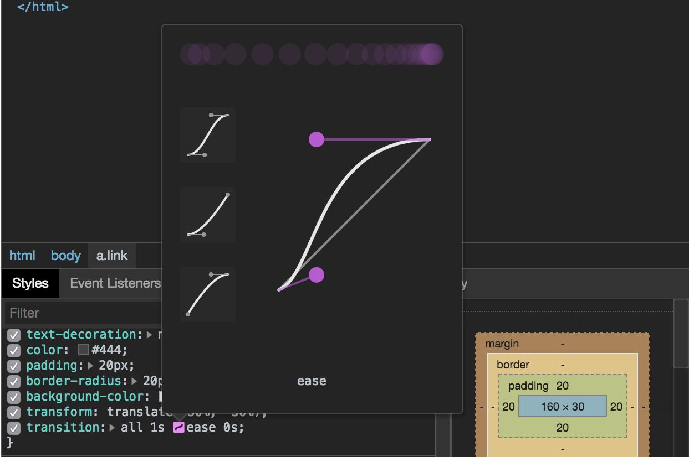

# まえがき

はじめまして、著者の[yui540](https://twitter.com/yui540)です。

~~今回、本書「[ごった煮技術書〜とりあえず詰め込んじゃいました〜](https://techbookfest.org/event/tbf05/circle/47180004)」をご購入いただき、本当にありがとうございます。~~

~~技術書典の存在は知ってはいたのですが、実際に行ったことがなく、Twitterで参加者のツイートを見ながら「いいな〜。行ってみたいな〜。」と思っていました。~~

~~それから時が過ぎ、友人からの誘いで、技術サークル「[バーチャルニート](https://virtual-neet.magical-girl.site)」の仲間に入れてもらい、技術書典5に参加することができました。~~

~~まさか、初参加が販売者側になるとは思っていませんでした（笑）~~

----------------------------------------------------------

【追記】

本書は「[ごった煮技術書〜とりあえず詰め込んじゃいました〜](https://4nm.booth.pm/items/1057195)」についてくるWeb本でしたが、たくさんの人に読んでもらいたいという思いから、僕の誕生日（2018/11/09）に無償で公開することにしました。

内容的にかなり雑で読みづらいかと思いますが、ちょっとでも雰囲気を楽しんでいただけたら嬉しく思います。

ｽｯ... [欲しいものリスト](http://amzn.asia/945r6YO) | [FANBOX](https://www.pixiv.net/fanbox/creator/16972511)

----------------------------------------------------------

さて、このWeb本のテーマは「CSSアニメーションを使った自己表現」です。

僕は趣味でCSSアニメーションを使って色々作っているのですが、その作品達が反響を呼び、たくさんの方々から感想をいただき、想像以上にCSSアニメーションを使った自己表現に需要があることを実感し、この「夜空ノ贈リ物」を書かせていただきました。

このWeb本は「ごった煮技術書」のオマケのようなものなので、おそらく技術的にはあまり得るものはないかもしれませんが、「アニメーションのタイミング」「イージング」「Webサイトを使った自己表現」など、みなさんがインタラクティブなWebサイトを制作するときのヒントにでもなれば幸いです。

（「紙の本じゃないのかよ！」って方、本当にすみません！最初は紙の本に書かせていただく予定でしたが、僕の事情により、Web上での公開とさせていただきました...。）

ですが、僕の世界観である「臆病な魔女」を十分に表現したこのサイトを用意しましたので、存分にお楽しみください。

「------------- ようこそ、臆病な魔女教団へ。」

# お礼の言葉

改めて、本書を買ってくださった方々に感謝させていただきます。本当にありがとうございます。

そして、本書を執筆するにあたり、僕を仲間に入れてくださったバーチャルニートのメンバーのみなさん、本書の執筆を応援してくださったみなさんにお礼をさせていただきます。

とても貴重な経験となりました。本当にありがとうございました！

# CSSアニメーションの基本

はい。では、さっそく「CSSアニメーションを使った自己表現」を実践していきたいところですが、その前にCSSアニメーションを使ったことがない人もいるかもしれませんので、先にCSSアニメーションの基本を説明したいと思います。

あまりオプション等の細かい説明はせず、ショートハンドで記述するので詳細を知りたい方は下記のリンクを参照ください。

[【CSS3】Transition（変化）関連のまとめ](https://qiita.com/7968/items/812d6a21fc4dd9ae9c75)

[CSSアニメーション入門](https://qiita.com/soarflat/items/4a302e0cafa21477707f)

## CSSアニメーションとは

CSSアニメーションは、従来のCSSではできなかったアニメーションを実現するものです。

アニメーションをさせるイメージとしては、ある時点のプロパティから、ある時点のプロパティに一定時間かけて徐々に変化していく感じですね。

そして、それを実現するためにCSSアニメーションには2つのプロパティが用意されています。

それがtransitionとanimationです。

それぞれに良い部分があるので、用途に合わせて使い分けるといいと思います。

本書では、動画のような派手なアニメーションを作っていくので主にanimationプロパティを使っていくかたちになります。

## transitionプロパティを知ろう

まずは、transitionプロパティについて軽く知っていきましょう。

transitionは、プロパティに変更があった場合、指定した時間かけてプロパティを変化させる機能を持っています。

主に使われる用途としては、メニューの表示・非表示やボタンのホバー時のアニメーションですね。

僕が過去に作ったサイトだと、↓こんなところで使われています（ホバーでしか使っていませんが...）

<iframe src="https://www.youtube.com/embed/jgdVVXrpXxM" frameborder="0" allow="autoplay; encrypted-media" allowfullscreen></iframe>

僕の場合、主にanimationプロパティを使うので、使用例がホバーくらいしかありませんが実際、他のサイトでは、メニュー表示・非表示、チェックボタンの状態変化など色々なところで使われています。

transitionプロパティの使われ方をみたところで簡単なサンプルを作って、transitionプロパティを理解していきましょう。

```html
<!doctype html>
  <head>
    <meta charset="utf-8" />
    <title>transition</title>
  </head>
  <body>
    <a class="link" href="#">ホバーしてみよう</a>
  </body>
</html>
```

```css
html, body { margin: 0; }

.link {
  position: absolute;
  top: 50%; left: 50%;
  display: block;
  font-size: 20px;
  text-decoration: none;
  color: #444;
  padding: 20px;
  border-radius: 20px;
  background-color: #fff;
  transform: translate(-50%, -50%);
  /*** ↓重要なのはここ ***/
  transition: all 1s ease 0s;
}
/*** ↓重要なのはここ ***/
.link:hover { box-shadow: 0 0 30px rgba(0,0,0,0.2); }
```

上記のようなコードを書くと、リンクにマウスを重ねると、要素が浮き上がっているような表現が出来上がります。

[完成品のリンク](/sample/transition)

<iframe src="https://www.youtube.com/embed/bRc2d80mHBg" frameborder="0" allow="autoplay; encrypted-media" allowfullscreen></iframe>

細かいスタイルの説明は省いて、transitionのみを解説します。

transitionプロパティは、transition-duration, transition-property, transition-timing-function, transition-delayをまとめて指定するためのショートハンドです。

本書では、記述を簡潔にするためにショートハンドのみを使用していきます。

で、先ほどのサンプルで記述した「transition: all 1s ease 0s;」は

一番の値に指定しているのは、transition-propertyの値で変化が適用されるプロパティを指定することができます。「all」は全てのプロパティを変化させる対象にします。（「color」などを指定して変化させるプロパティを制限することもできます。）

二番目の値に指定しているのは、transition-durationの値でアニメーションの時間を指定することができます。今回指定している「1s」は1秒を表しています。（1msなどのような指定もできます。）

三番目の値に指定しているのは、transition-timing-functionの値でアニメーションのイージングを指定することができます。イージングというのはアニメーションする時の緩急とイメージしてもらえればわかりやすいかと思います。ease, ease-in, ease-out, ease-in-out, linearなどの値が用意されています。（cubic-bezierでカスタマイズも可能。）

四番目の値に指定しているのは、transition-delayの値でアニメーションの開始時間を指定することができます。指定する値はtransition-durationと同じ形式で指定することができます。

対象の要素にtransitionプロパティを適用したら、あとは変更するプロパティを:hover等に指定すれば終わりです。

transitionプロパティの仕組みを理解したら、どういう用途で使うべきなどかなどを研究してみると面白いWebサイトを作る上でのアイデアが湧いてくるかもしれませんのでどんどん色々なことを試してみてください。

## animationプロパティについて知ろう

次に、animationプロパティについて軽く知っていきましょう。

animationプロパティはtransitionプロパティと違い、キーフレームを指定してアニメーションを構築していきます。

キーフレームとは、アニメーションの開始から終了までの任意の経過地点にプロパティを指定できる仕組みです。AfterEffectsなどのモーショングラフィックソフトを使ったことのある方はタイムラインをイメージしていただければ理解しやすいかと思います。

そして、このキーフレームを使うことでtransitionプロパティには出来ない複雑なアニメーションを構築することが出来ます。

一般的な使われ方としては、ローディングなどのループのアニメーションに使われることが多い印象があります。

ただ、僕の場合はWebサイトのオープニングアニメーションやメインビジュアルのアニメーションなど、本来であればHTML5CanvasやWebGLなどが担当するような実装をanimationプロパティを駆使して再現しています。

<iframe src="https://www.youtube.com/embed/5EW1imyH_Wk" frameborder="0" allow="autoplay; encrypted-media" allowfullscreen></iframe>

<iframe src="https://www.youtube.com/embed/ykfmALMn6s4" frameborder="0" allow="autoplay; encrypted-media" allowfullscreen></iframe>

animationプロパティの使われ方をみたところで簡単なサンプルを作って、animationプロパティを理解していきましょう。

```html
<!doctype html>
<html>
  <head>
    <meta charset="utf-8">
    <title>animation</title>
    <link rel="stylesheet" href="./style.css" />
  </head>
  <body>
    <div class="wrap">
      <div class="bar"></div>
      <div class="bar"></div>
      <div class="bar"></div>
      <div class="bar"></div>
      <div class="bar"></div>
      <div class="bar"></div>
    </div>
  </body>
</html>
```

```css
html, body { margin: 0; }

.wrap {
  position: absolute;
  top: 0; left: 0;
  width: 100%; height: 100%;
  display: flex;
  flex-direction: column;
  justify-content: center;
  align-items: center;
}

.wrap .bar {
  width: 300px; height: 50px;
  margin: 10px 0;
  background-color: #ccc;
}

/***************************************************************
  animation
****************************************************************/
.wrap .bar:nth-child(1) {
  animation: show-bar 1s linear 0s forwards; /*** ここが重要 ***/
}
.wrap .bar:nth-child(2) {
  animation: show-bar 1s ease 0s forwards; /*** ここが重要 ***/
}
.wrap .bar:nth-child(3) {
  animation: show-bar 1s ease-in 0s forwards; /*** ここが重要 ***/
}
.wrap .bar:nth-child(4) {
  animation: show-bar 1s ease-out 0s forwards; /*** ここが重要 ***/
}
.wrap .bar:nth-child(5) {
  animation: show-bar 1s ease-in-out 0s forwards; /*** ここが重要 ***/
}
.wrap .bar:nth-child(6) {
  animation: show-bar 1s cubic-bezier(0.87, -0.01, 0.1, 0.99) 0s forwards; /*** ここが重要 ***/
}

/***************************************************************
  keyframes
****************************************************************/
@keyframes show-bar { /*** ここが重要 ***/
  from { width: 0; background-color: #eee; }
  to   { width: 330px; background-color: #1b9097; }
}
```

上記のようなコードを書くと、各イージングを確認できるサンプルが出来上がります。

[完成品のリンク](/sample/animation)

<iframe src="https://www.youtube.com/embed/DBzCkjCWguk" frameborder="0" allow="autoplay; encrypted-media" allowfullscreen></iframe>

細かいスタイルの説明は省いて、animationと@keyframesについて簡単に解説します。

まずはじめに@keyframesについて説明します。

@keyframesは、@規則に基づいてアニメーションの任意の経過地点にプロパティを記述してキーフレームアニメーションを構築します。

経過地点の指定方法として2点以上の場合、0%〜100%の記述を使いますが、2点のみ場合はfrom/toという記述をすることが出来ます。今回のサンプルでは2点のみなのでfrom/toで記述しています（0%〜100%でも可）

次にanimationプロパティについて説明します。

animationプロパティは、animation-name, animation-duration, animation-timing-function, animation-delay, animation-iteration-count, animation-direction, animation-fill-mode, animation-play-stateをまとめて指定するためのショートハンドです。（省略可能なものもあるため、本書では扱わないオプションもあります。）

先ほどのサンプルの「animation: show-bar 1s linear 0s forwards;」は

一番目の値に指定しているのは、animation-nameでキーフレーム名を指定します。キーフレーム名は@keyframesで記述したものを指定します。

二番目の値に指定しているのは、animation-durationでアニメーション時間を指定することが出来ます。（transition-duration, transition-delayと記述方法は同じです）

三番目の値に指定しているのは、animation-timing-functionでアニメーションのイージングを指定することが出来ます。（イージングについては後述）

四番目の値に指定しているのは、animation-delayでアニメーションの開始時間を指定することが出来ます。(transition-duration, transition-delayと記述方法は同じです)

五番目の値に指定しているのは、animation-fill-modeでキーフレームで指定したプロパティをアニメーション開始前、終了後に適用するかどうかを指定することが出来ます。「forwards」はアニメーション終了後のプロパティを保持します。（forwards, backwards, bothなどがあります）

で、今回のサンプルでは6つの要素それぞれ別のイージングを指定しています。

イージングというのは、transitionの時に説明したようにアニメーションの緩急を指定できるものになっています。

あらかじめ用意されているイージングにはlinear, ease, ease-in, ease-out, ease-in-outがあります。ちょっとしたアニメーションなどを作る場合はこれらで事足りるのですが、プロダクトによってはどうしてもイージングにこだわりたい部分が出てくるかと思います。

そこで使用するのがcubic-bezierです。cubic-bezierは開発者が自由にイージングを調整することが出来ます。

と、言ってもコードでイージングを調整するのは厳しいのでChromeのデベロッパーツールもしくは、[このサイト](http://cubic-bezier.com)を使うとベジェ曲線で直感的にイージングを調整することが出来ます。



イージングを自分で調整してみてアニメーションの感覚を掴んでみたり、今回のサンプルでは指定しませんでしたがanimation-directionでアニメーションの向きを変えてみたりと色々工夫してみると面白いアニメーションが生み出せるかもしれなのでどんどんコードを書いてみてください。
